# 🍭 Sweetify - Sweet Shop Management System

Welcome to Sweetify, a full-stack TDD (Test-Driven Development) kata. This project is a complete Sweet Shop Management System, featuring a secure Node.js backend API and a modern, responsive React frontend.

The entire backend was built using a strict Red-Green-Refactor TDD workflow.

**🔍 Checkout website here:** [SweetShopKata](https://sweet-shop-kata.netlify.app/)
- Hosted frontend with [Netlify](https://www.netlify.com/) and backend with [Render](https://render.com/)


---

## Features

* **User Authentication:** Secure user registration and login with JWT (JSON Web Tokens).
* **Role-Based Access:** Separate permissions for `Customers` and `Admins`.
* **Public Homepage:** A beautiful, responsive homepage where users can browse products *before* logging in.
* **Product Showcase:** Homepage includes a main banner, popular categories, best-sellers, and a filterable "All Products" grid.
* **Full Shopping Cart:**
    * **Add to Cart:** Add items from any product card.
    * **Slide-Out Cart:** A dynamic cart slider to view and manage items.
    * **Quantity Control:** Users can update item quantities directly from the cart.
* **Secure Checkout:** A multi-step purchase flow with a confirmation modal and an animated success message.
* **Admin Dashboard:**
    * Full **CRUD** (Create, Read, Update, Delete) for all sweets.
    * **Image Management:** Ability to add and update image URLs.
    * **Stock Control:** "Restock" functionality to manage inventory levels.
* **Live Search:** A debounced search bar in the navbar for finding products quickly.

---

## Tech Stack

* **Backend:** Node.js, Express.js
* **Frontend:** React, Vite, Tailwind CSS
* **Database:** MongoDB (with Mongoose)
* **Authentication:** JSON Web Tokens (JWT), bcrypt.js
* **Testing:** Jest, Supertest

---

## Setup & Installation

To run this project locally, you will need [Node.js](https://nodejs.org/en/download) installed on your system and create a free MongoDB Atlas account and cluster in [MongoDB Atlas](https://cloud.mongodb.com) and get your connection string (URI) from the Atlas dashboard.

### 1. Backend Setup

```bash
# 1. Clone the repository
git clone https://github.com/IMMANUEL-88/sweet-shop-kata
cd sweet-shop-kata/backend

# 2. Install dependencies
npm install

# 3. Create your .env file
# Create a file named .env in the /backend folder and add the following:
PORT=5000
JWT_SECRET=your_super_secret_key
MONGO_URI=your_mongodb_connection_string/sweet-shop-dev

# 4. Run the backend server
npm run dev
```
The backend will be running on `http://localhost:5000`.

### 2. Frontend Setup

```bash
# 1. In a new terminal, navigate to the frontend folder
cd sweet-shop-kata/frontend

# 2. Install dependencies
npm install

# 3. Run the frontend development server
npm run dev
```
The frontend will be live at `http://localhost:5173` (or the next available port) and will be proxied to your backend.

---

## Screenshots

**Login Page**

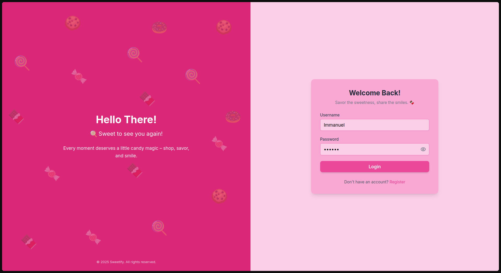


**Register Page**

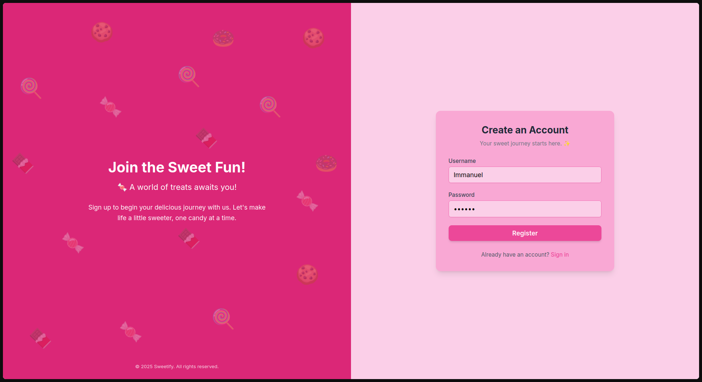


**Home Page**

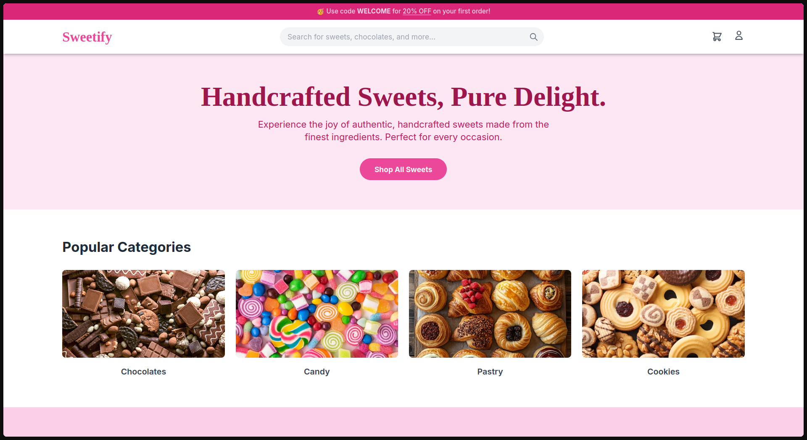
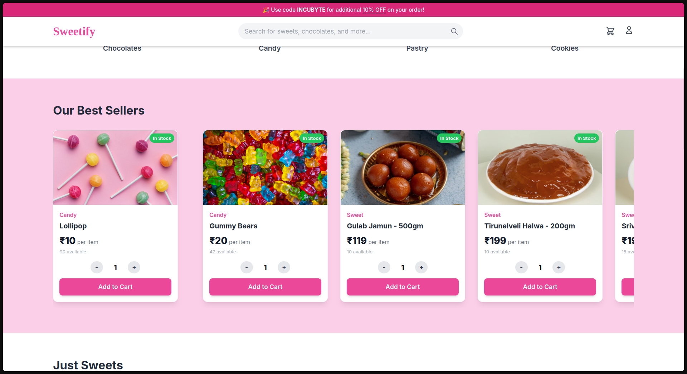
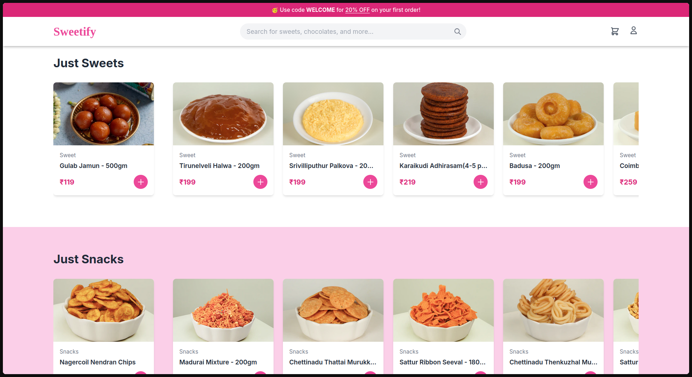
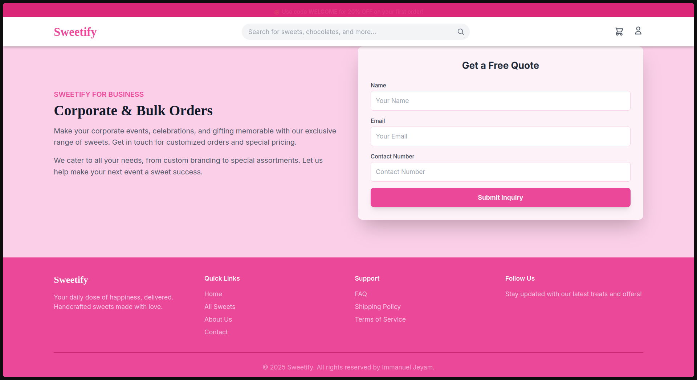


**Dashboard Page**

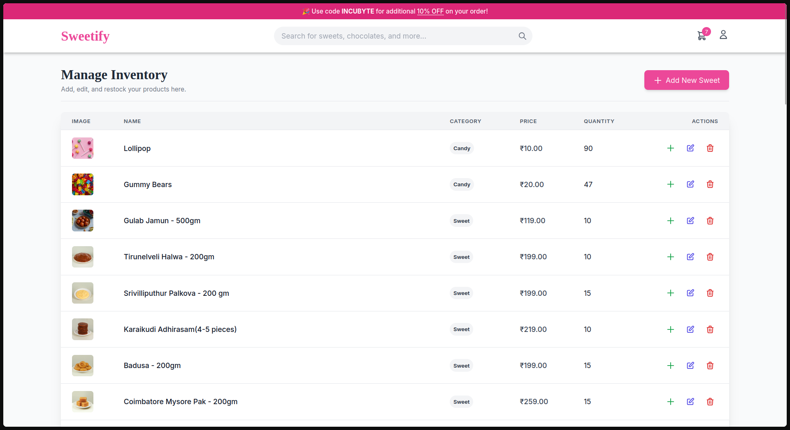
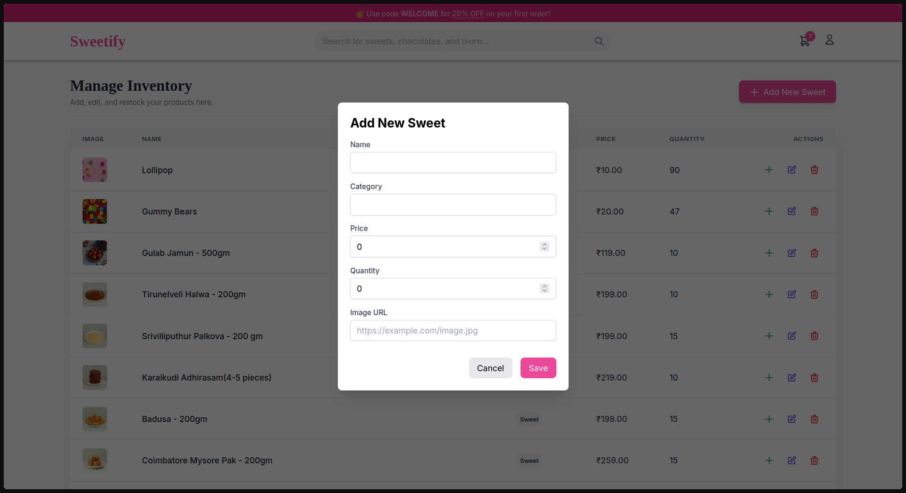


**Search PopUp**

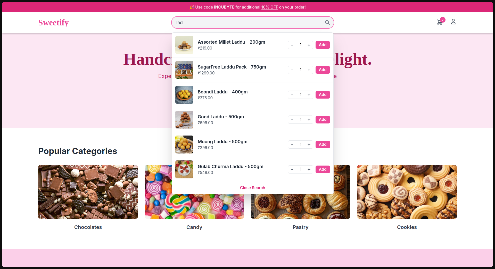


**Category Popup**

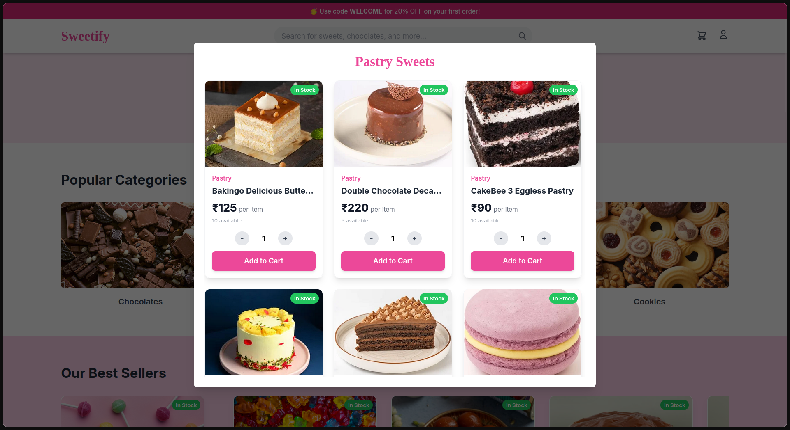


**Cart Page**

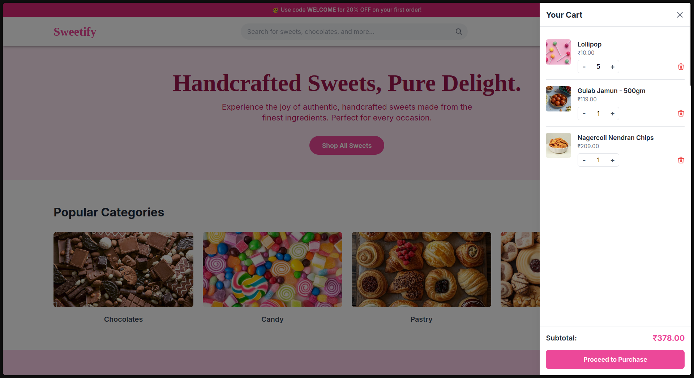
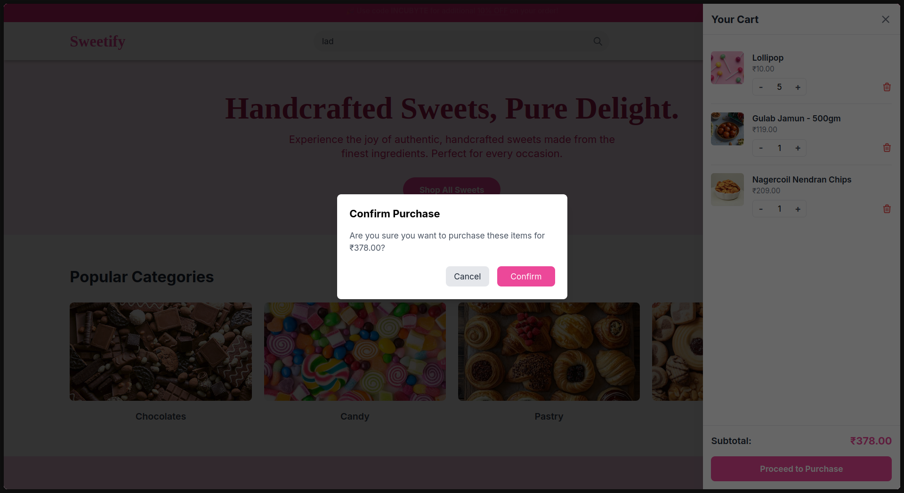
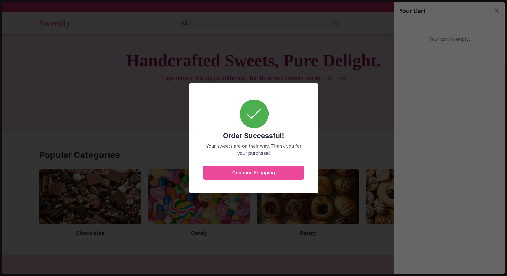

---

## Test Report

All backend API endpoints are validated with a full test suite.

```bash
# To run the test suite:
cd backend
npm test
```

### Test Results:

```
 PASS  tests/auth.test.js
  POST /api/auth/register
    ✓ should register a new user successfully (707 ms)
    ✓ should fail if username is taken (317 ms)
  POST /api/auth/login
    ✓ should log in a user with correct credentials (313 ms)
    ✓ should fail with incorrect password (303 ms)
    ✓ should fail with non-existent username (271 ms)

 PASS  tests/sweets.test.js (47.527 s)
  POST /api/sweets
    ✓ should fail with 401 (Unauthorized) if no token is provided (1099 ms)
    ✓ should fail with 403 (Forbidden) if a non-admin user (customer) tries to add a sweet (672 ms)
    ✓ should fail with 400 (Bad Request) if admin provides invalid data (missing name) (676 ms)
    ✓ should successfully create a new sweet if admin user is authenticated (764 ms)
  GET /api/sweets
    ✓ should fail with 401 (Unauthorized) if no token is provided (629 ms)
    ✓ should return an empty array if no sweets exist (702 ms)
    ✓ should return a list of all sweets for an authenticated customer (804 ms)
    ✓ should return a list of all sweets for an authenticated admin (807 ms)
  GET /api/sweets/search
    ✓ should fail with 401 (Unauthorized) if no token is provided (758 ms)
    ✓ should return all sweets if no search query is provided (869 ms)
    ✓ should search by name (case-insensitive) (818 ms)
    ✓ should search by category (860 ms)
    ✓ should search by price range (min and max) (813 ms)
    ✓ should search by price range (min only) (818 ms)
    ✓ should combine search queries (category and name) (806 ms)
    ✓ should return an empty array for no results (818 ms)
  PUT /api/sweets/:id
    ✓ should fail with 401 (Unauthorized) if no token is provided (755 ms)
    ✓ should fail with 403 (Forbidden) if a non-admin user (customer) tries to update (832 ms)
    ✓ should fail with 404 (Not Found) if the sweet does not exist (836 ms)
    ✓ should fail with 400 (Bad Request) if admin provides invalid data (e.g., empty name) (817 ms)
    ✓ should successfully update the sweet if admin is authenticated (924 ms)
  DELETE /api/sweets/:id
    ✓ should fail with 401 (Unauthorized) if no token is provided (725 ms)
    ✓ should fail with 403 (Forbidden) if a non-admin user (customer) tries to delete (796 ms)
    ✓ should fail with 404 (Not Found) if the sweet does not exist (971 ms)
    ✓ should successfully delete the sweet if admin is authenticated (936 ms)
  POST /api/sweets/:id/purchase
    ✓ should fail with 401 (Unauthorized) if no token is provided (769 ms)
    ✓ should fail with 404 (Not Found) if the sweet does not exist (1512 ms)
    ✓ should fail with 400 (Bad Request) if the sweet is out of stock (1839 ms)
    ✓ should successfully purchase a sweet and decrease quantity by 1 (as customer) (1553 ms)
    ✓ should successfully purchase a sweet and decrease quantity by 1 (as admin) (885 ms)
  POST /api/sweets/:id/restock
    ✓ should fail with 401 (Unauthorized) if no token is provided (804 ms)
    ✓ should fail with 403 (Forbidden) if a non-admin user (customer) tries to restock (774 ms)
    ✓ should fail with 404 (Not Found) if the sweet does not exist (810 ms)
    ✓ should fail with 400 (Bad Request) if the amount is missing or invalid (1085 ms)
    ✓ should successfully restock the sweet and increase quantity (as admin) (872 ms)
  POST /api/cart - Add Item to Cart
    ✓ should fail with 401 Unauthorized if no token is provided (701 ms)
    ✓ should fail with 404 Not Found if the sweet does not exist (951 ms)
    ✓ should fail with 400 Bad Request if quantity is zero or negative (761 ms)
    ✓ should successfully add a new item to the user cart (963 ms)
    ✓ should update the quantity if the same item is added to the cart again (1133 ms)
  GET /api/cart - View Cart
    ✓ should fail with 401 Unauthorized if no token is provided (730 ms)
    ✓ should return an empty array for a user with an empty cart (904 ms)
    ✓ should return all items in the user’s cart with full sweet details (1051 ms)
  DELETE /api/cart/:id - Remove Item from Cart
    ✓ should fail with 401 Unauthorized if no token is provided (882 ms)
    ✓ should fail with 404 Not Found if the item is not in the cart (959 ms)
    ✓ should successfully remove a single item from the cart (1220 ms)
  POST /api/cart/purchase - Purchase from Cart
    ✓ should fail with 401 Unauthorized if no token is provided (940 ms)
    ✓ should fail with 400 Bad Request if the cart is empty (1188 ms)
    ✓ should fail with 400 Bad Request if *one* item in the cart is out of stock (1139 ms)
    ✓ should successfully purchase items, decrease stock, and clear the cart (1280 ms)

Test Suites: 2 passed, 2 total
Tests:       55 passed, 55 total
Snapshots:   0 total
Time:        47.652 s, estimated 53 s
Ran all test suites.
```

---

## My AI Usage

This project was built in collaboration with an AI assistant (Google's Gemini) as a pair-programming partner.

* **Tools Used:** Google Gemini

* **How I Used It:**
    * **Backend TDD:** I used the AI to generate the "Red" (failing test) for each new endpoint based on the requirements. I would then collaborate with AI to write the "Green" (passing) code myself, and afterward, I would ask the AI to "Refactor" my code or suggest improvements (like using `asyncHandler` or atomic operations).
    * **Frontend Development:** I asked the AI to generate entire React components (like `Navbar`, `SweetCard`, and `CartSlider`) based on my feature descriptions and preferred tech (Tailwind CSS).
    * **Debugging (Most Critical):** I frequently pasted error messages (from both Jest and the browser console) directly to the AI. It helped me diagnose the root cause of complex bugs, including:
        * JavaScript typos (`e.targe` vs. `e.target.value`).
        * React infinite loops (`useCallback` dependencies).
        * CSS `z-index` stacking context problems.
        * Jest test pollution between parallel test files.
    * **Git Commits:** I asked the AI to generate descriptive, conventional commit messages for each TDD step.

* **My Reflection:** Using an AI as a pair programmer was incredibly effective. It allowed me to focus on the *architecture* and *logic* while it handled the boilerplate for tests and UI components. The debugging process was the most valuable; instead of being stuck for hours on a cryptic error, I could get an immediate diagnosis and solution, which taught me *why* the bug was happening. It made the entire TDD process faster and more educational.


